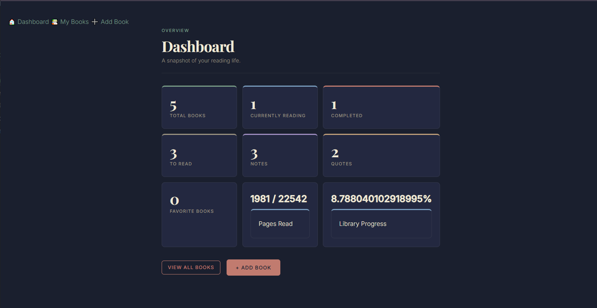
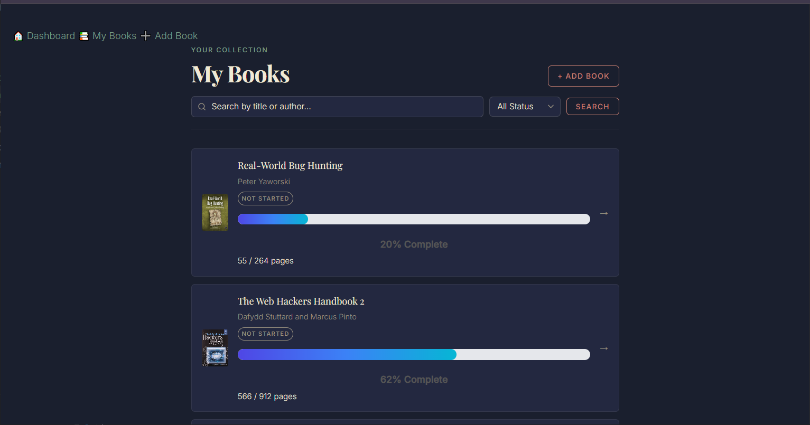
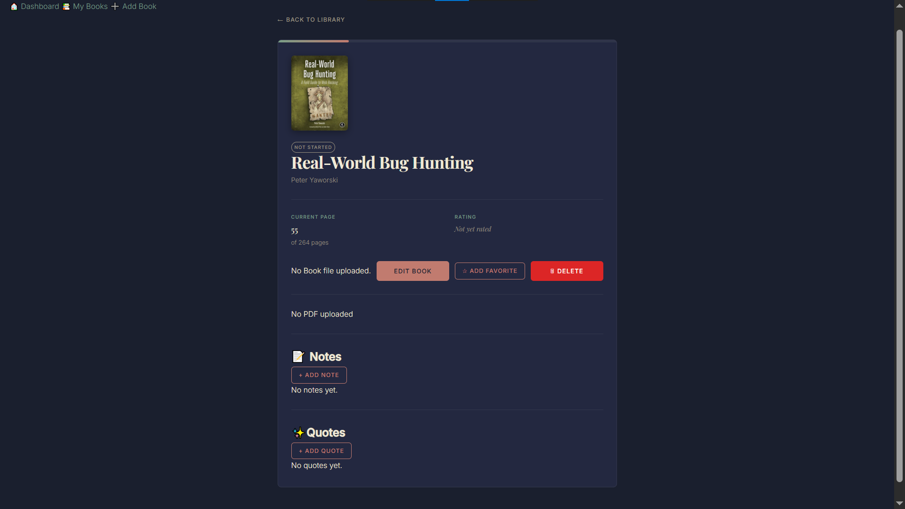

# 📚 Book Manager

A modern Django web application for managing your personal book collection.

## ✨ Features

- 📚 Add, update and delete books
- 🖼 Upload book cover images
- 📄 Upload PDF/EPUB files
- ⭐ Mark books as favorites
- 📖 Track reading progress
- 📝 Create, edit and delete notes
- 💬 Save memorable quotes
- 🔍 Search books
- 🎯 Filter books by status
- 📄 Pagination
- 📊 Reading dashboard

---

## 🛠 Tech Stack

- Python 3
- Django
- HTML
- CSS
- SQLite

---

## 📷 Screenshots

*(Add screenshots here later)*

### Dashboard



### Book List



### Book Detail



---

## 🚀 Installation

Clone the repository:

```bash
git clone https://github.com/powervail/Book-Manager.git
```

Move into the project:

```bash
cd Book-Manager
```

Install dependencies:

```bash
pip install -r requirements.txt
```

Run migrations:

```bash
python manage.py migrate
```

Start the server:

```bash
python manage.py runserver
```

Open:

```
http://127.0.0.1:8000/
```

---

## 📌 Future Improvements

- 📖 In-app PDF Reader
- 📚 EPUB Reader
- 🔖 Bookmarks
- 🖍 Highlights
- 📍 Resume Reading
- 📈 Reading Analytics

---

## 👨‍💻 Author

**Sathish**

GitHub:
https://github.com/powervail